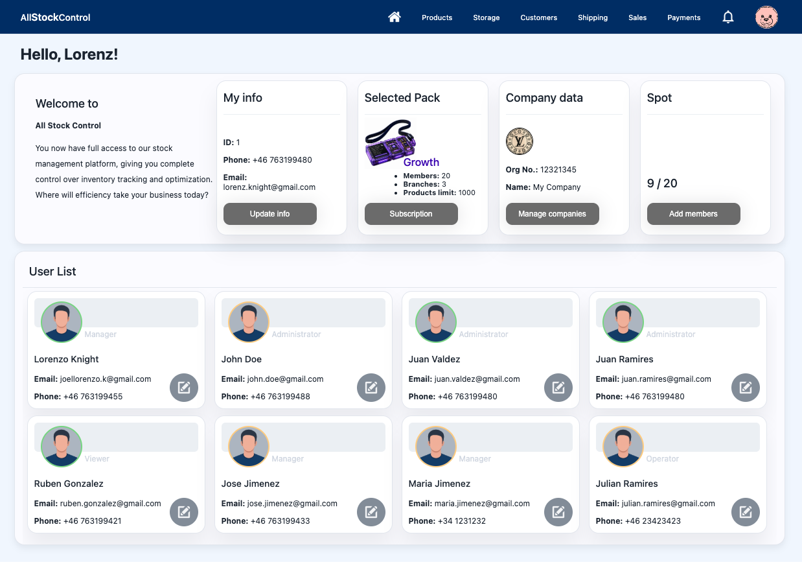
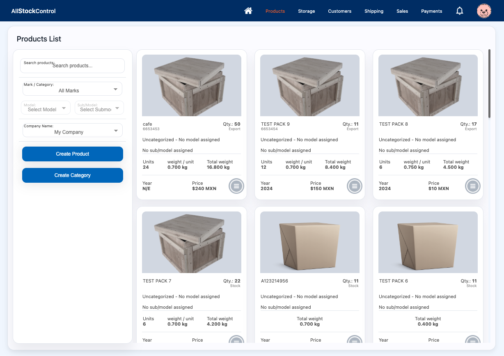
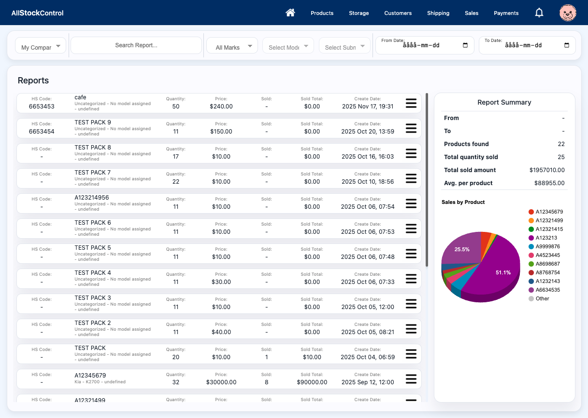

# AllStockControl

**A SaaS inventory and business management platform built for companies that need to manage products, stock, logistics and day-to-day operations from one system.**

🌐 **Live product:** https://www.allstockcontrol.com/

---

## About the project

AllStockControl is a full-stack SaaS platform that I design and develop end-to-end.

The project started from the idea of creating a flexible inventory management system and has evolved into a broader business platform covering inventory, logistics, customers, reporting, subscriptions and multi-company workflows.

As the developer and product owner, I work across the complete technical lifecycle — from architecture and database design to backend development, APIs, integrations, security, frontend and deployment.

The project also involves continuously evolving and refactoring the platform as new requirements and use cases emerge.

## Product Preview

### Dashboard



### Product Management



### Reports



## Tech Stack

### Backend
- PHP 8
- PostgreSQL
- REST APIs
- JWT authentication
- WebSockets
- Stripe API integration

### Frontend
- JavaScript
- HTML5
- CSS3
- Dynamic UI rendering

### Infrastructure & Development
- Docker / Docker Compose
- PHP 8 FPM
- Nginx (local development)
- Apache (production)
- Linux
- Git
- PHPUnit
- Environment-based configuration

## Core Features

- Inventory and stock management
- Product, category and brand management
- Shipping and logistics workflows
- Customer management
- Multi-company support
- Role and permission management
- Real-time notifications
- Reporting
- Stripe subscriptions and payments
- REST API integrations
- WebSocket-based communication
- Authentication and authorization

## Engineering Focus

The platform is designed around:

- Maintainable and modular backend architecture
- Clear separation of concerns
- Secure authentication and authorization
- Relational database design
- API-driven integrations
- Real-time communication
- Incremental modernization and refactoring
- Extensible SaaS architecture

## What this project demonstrates

Building AllStockControl has required me to work beyond individual features and take ownership of the product as a whole.

This includes making architectural decisions, designing database structures, building APIs and integrations, debugging production issues, implementing security and permissions, evolving existing code and balancing technical improvements with actual product needs.

It represents the type of product-oriented backend/full-stack engineering I enjoy working with.

## Local Development

The local development environment is containerized using Docker,
with PHP 8 FPM, Nginx and PostgreSQL.

Production runs on an Apache-based environment.

### Start

```bash
make start
```

### Stop

```bash
make down
```

### Database migrations

```bash
make migrate
```

### Run tests

```bash
docker-compose run php vendor/bin/phpunit
```


## Author

Lorenz Knight

Senior Backend / Full-stack Developer

🌐 https://www.allstockcontrol.com/